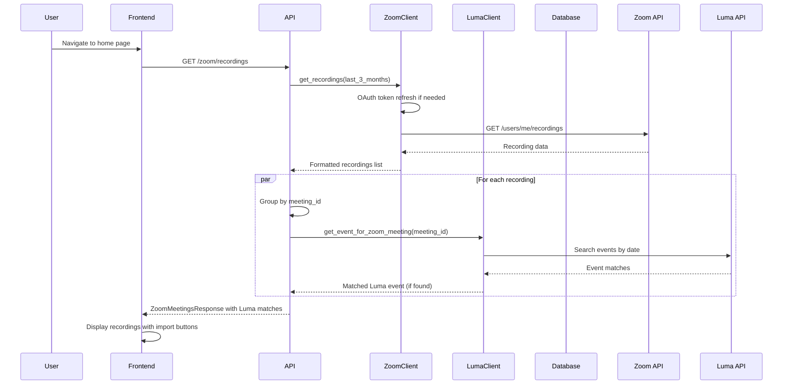
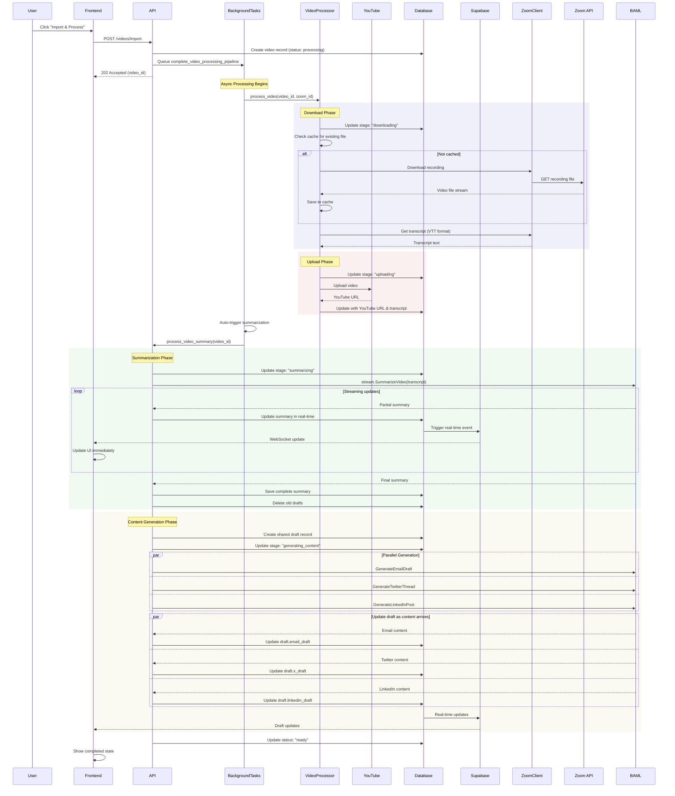
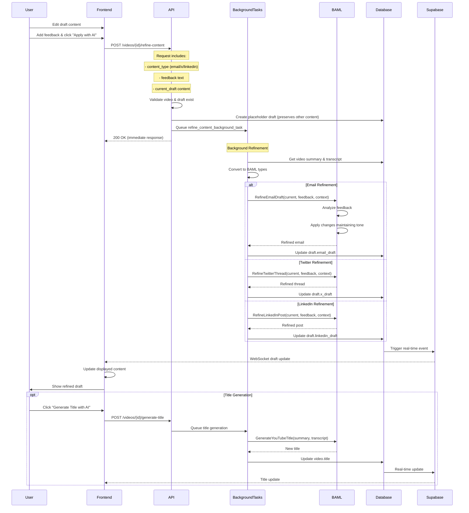
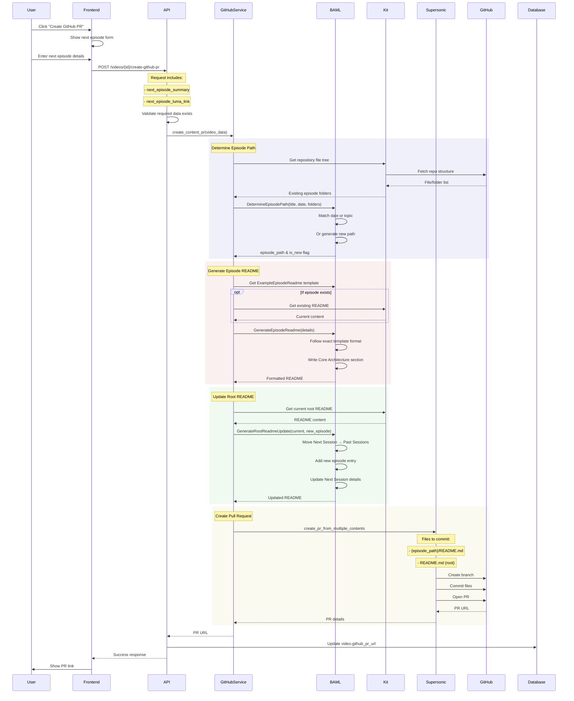
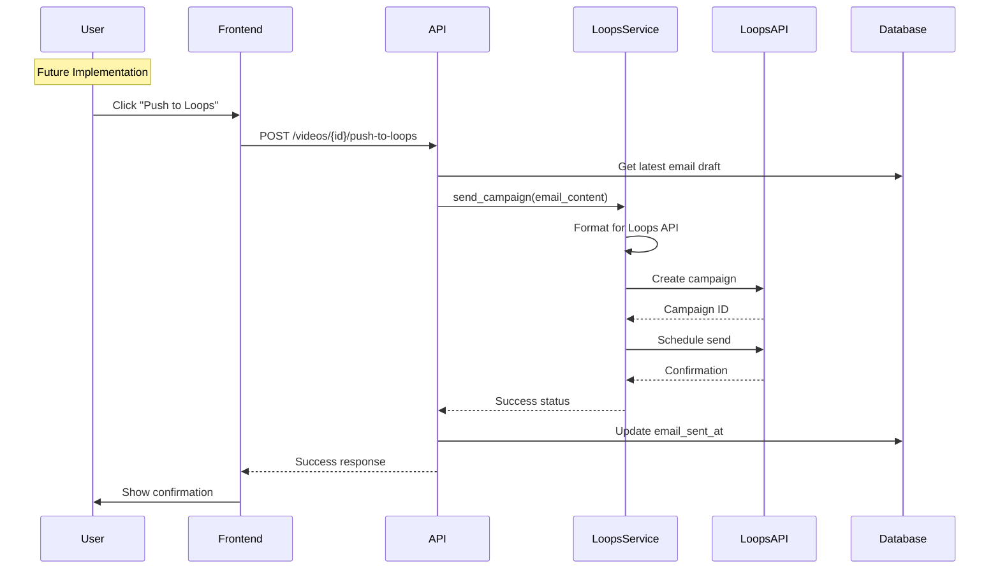

# AI Content Pipeline Architecture

## Overview

The AI Content Pipeline is an automated system that transforms Zoom recordings into multi-platform content using various AI services. It processes video recordings through transcription, summarization, and content generation stages, ultimately creating drafts for email newsletters, social media posts, and GitHub pull requests.

## Components

### Backend Services
- **FastAPI Server** (`backend/main.py`): Main API server handling all HTTP endpoints
- **Database Service** (`backend/database.py`): Supabase client for PostgreSQL operations
- **Zoom Client** (`backend/zoom_client.py`): OAuth-based Zoom API integration for fetching recordings
- **Video Processor** (`backend/video_processor.py`): Downloads Zoom recordings and uploads to YouTube
- **Luma Client** (`backend/luma_client.py`): Integration with Luma calendar for event matching
- **GitHub PR Service** (`backend/github_pr_service.py`): Creates PRs using Supersonic library
- **BAML Client** (`backend/baml_client/`): AI orchestration for content generation

### Frontend Components
- **Next.js App** (`frontend/src/app/`): React-based UI with real-time updates
- **Video List** (`frontend/src/components/home/video-list.tsx`): Displays processed videos
- **Zoom Recordings List** (`frontend/src/components/zoom/zoom-recordings-list.tsx`): Shows available Zoom meetings
- **Video Detail Page** (`frontend/src/app/videos/[id]/page.tsx`): Full video processing interface
- **Draft Editor** (`frontend/src/components/video/draft-editor.tsx`): Edit and refine AI-generated content
- **GitHub PR Button** (`frontend/src/components/github/CreateGitHubPRButton.tsx`): Manual PR creation trigger

### AI Functions (BAML)
- **SummarizeVideo**: Generates structured summary with bullet points, key topics, and takeaways
- **GenerateEmailDraft**: Creates newsletter draft in two stages (structure → full email)
- **GenerateTwitterThread**: Produces multi-tweet thread with hashtags
- **GenerateLinkedInPost**: Creates professional LinkedIn post
- **RefineEmailDraft/TwitterThread/LinkedInPost**: Iterates on content based on user feedback
- **GenerateYouTubeTitle**: Creates engaging video titles
- **DetermineEpisodePath**: Intelligently matches or creates episode folder names
- **GenerateEpisodeReadme**: Creates formatted episode documentation
- **GenerateRootReadmeUpdate**: Updates repository README with new episode

## Architecture Diagrams

### Loading Phase - Fetching Zoom Recordings and Matching to Luma Events

### Processing Phase - Complete Video Pipeline

### Draft Iteration - Refining Content with User Feedback

### GitHub PR Creation - Manual Trigger with AI-Powered Content

### Email Push to Loops - Future Integration

## Real-Time Updates

The system uses Supabase's real-time subscriptions to provide instant UI updates:

1. **Video Updates**: Status changes, processing stages, summary generation
2. **Draft Updates**: Content generation and refinement updates
3. **WebSocket Channels**: Dedicated channels per video for targeted updates
4. **Auto-reconnection**: Exponential backoff for connection reliability

## Key Design Decisions

1. **Parallel Processing**: Content generation runs concurrently for all platforms
2. **Streaming AI Responses**: Summary updates stream to UI in real-time
3. **Single Draft Model**: One draft record updated incrementally vs multiple versions
4. **Manual PR Trigger**: GitHub PRs require user action, not automatic
5. **Video Caching**: Downloaded Zoom videos cached locally to avoid re-downloads
6. **Smart Path Matching**: AI determines if episode already exists or needs new folder
7. **Background Tasks**: Long-running operations don't block API responses
