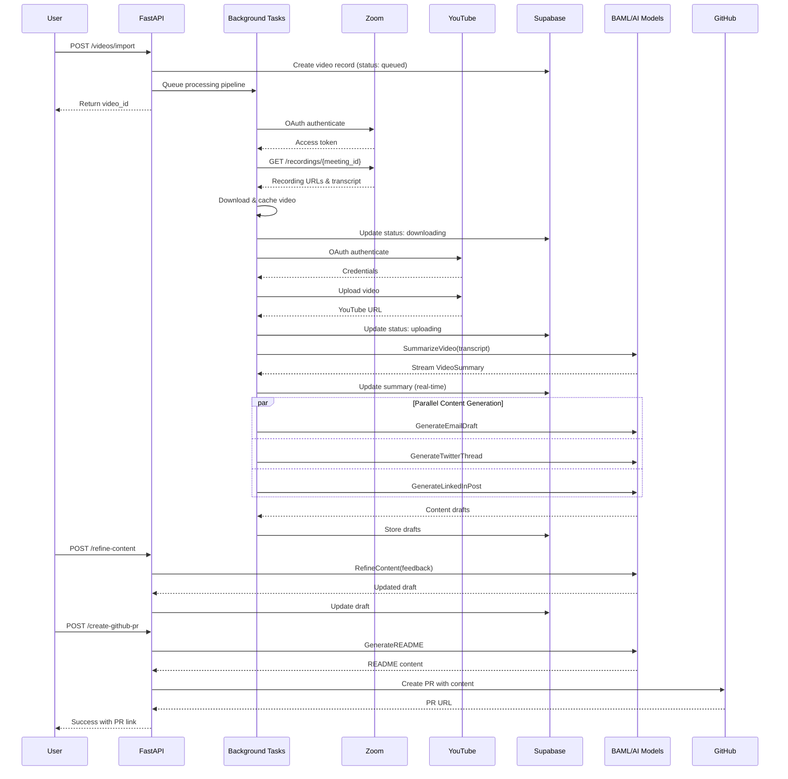

# Research: Full Architecture of Content Pipeline in 2025-07-01-ai-content-pipeline-2

**Date**: 2025-08-16T11:05:39-07:00
**Researcher**: claude
**Git Commit**: 0a670a4d771a4a57ee2e51dcd99aedab236f3d1f
**Branch**: main
**Repository**: ai-that-works

## Research Question
Explain the full architecture of the content pipeline in 2025-07-01-ai-content-pipeline-2, focusing on API integrations, tokens, AI calls, and data flow. Include analysis of how the system could be broken into modular command-line tools.

## Summary
The content pipeline is a sophisticated AI-powered system that transforms Zoom recordings into multi-platform content (YouTube, Email, Twitter, LinkedIn, GitHub) using a two-phase "Extract → Polish" architecture. Built on FastAPI + BAML + Supabase, it orchestrates multiple AI models (OpenAI, Anthropic, Google) through type-safe interfaces with real-time streaming updates. The system demonstrates clear separation of concerns suitable for modularization into CLI tools.

## Detailed Findings

### Pipeline Architecture Overview

#### Core Components
- **Backend**: FastAPI server (`backend/main.py:52`) with async processing
- **AI Orchestration**: BAML framework (`backend/baml_src/`) for type-safe AI calls
- **Database**: Supabase with real-time WebSocket updates (`backend/database.py:12`)
- **Frontend**: Next.js with live UI updates (`frontend/`)
- **External Services**: Zoom, YouTube, GitHub, Luma integrations

#### Main Entry Point
- `backend/main.py:1085` - FastAPI application initialization
- Key endpoints:
  - `POST /videos/import` (line 253) - Initiates pipeline
  - `POST /videos/{id}/summarize` (line 347) - AI summarization
  - `POST /videos/{id}/refine-content` (line 692) - Content refinement
  - `POST /videos/{id}/create-github-pr` (line 896) - PR creation

### API Integrations and Authentication

#### 1. AI Service Integrations (`backend/baml_src/clients.baml`)
| Service | Model | Authentication | Purpose |
|---------|-------|---------------|---------|
| OpenAI | GPT-4o, GPT-4o-mini | `OPENAI_API_KEY` | Content generation, refinement |
| Anthropic | Claude-3.5-Sonnet, Claude-3-Haiku | `ANTHROPIC_API_KEY` | Strategic tasks, README generation |
| Google Vertex AI | Gemini-2.0-flash, Gemini-2.5-pro | `GOOGLE_CLOUD_PROJECT` | Email generation |

#### 2. External Service Integrations
| Service | Auth Type | Token/Key | Purpose |
|---------|-----------|-----------|---------|
| Zoom | OAuth 2.0 S2S | `ZOOM_CLIENT_ID/SECRET` | Recording retrieval |
| YouTube | OAuth 2.0 | Google credentials | Video upload |
| GitHub | PAT | `GITHUB_TOKEN` | PR automation |
| Luma | API Key | `LUMA_API_KEY` | Event calendar |
| Supabase | Service Key | `SUPABASE_ANON_KEY` | Database & real-time |

#### 3. Authentication Patterns
- **OAuth Token Management**: `backend/zoom_client.py:44-58` - Automatic refresh
- **API Key Headers**: Environment-based configuration (`backend/env.template`)
- **Retry Policies**: Exponential backoff and fallback strategies (`backend/baml_src/clients.baml:59-77`)

### AI Model Calls and Prompts

#### Two-Phase Content Generation Architecture
1. **Extract Phase**: Structured data extraction from transcripts
   ```baml
   function SummarizeVideo(transcript: string, title: string?) -> VideoSummary
   ```
   - Returns: `main_takeaways`, `key_topics`, `bullet_points`

2. **Polish Phase**: Platform-specific content generation
   ```baml
   function GenerateTwitterThread(summary: VideoSummary, ...) -> TwitterThread
   function GenerateLinkedInPost(summary: VideoSummary, ...) -> LinkedInPost
   function DraftEmail(summary: VideoSummary, structure: EmailStructure) -> EmailDraft
   ```

#### AI Orchestration Features
- **Streaming Responses**: Real-time UI updates (`backend/main.py:390-402`)
- **Parallel Generation**: Simultaneous content creation (`backend/main.py:442-536`)
- **Template-Based Prompting**: Consistent output formatting
- **Fallback Strategies**: Multi-provider redundancy

### Data Flow Through the System



### Processing Pipeline Stages

1. **Queued** → Initial state after import request
2. **Downloading** → Fetching from Zoom with caching
3. **Uploading** → Publishing to YouTube
4. **Summarizing** → AI extraction of key points
5. **Generating Content** → Parallel multi-platform generation
6. **Ready** → All content generated, awaiting review

### Modularization Opportunities for CLI Tools

Based on the architecture analysis, here are natural boundaries for CLI tool separation:

#### 1. **zoom-fetch** - Recording Retrieval Tool
```bash
zoom-fetch --meeting-id <id> --output video.mp4 --transcript output.vtt
```
- Handles OAuth authentication
- Downloads recordings with caching
- Extracts transcripts

#### 2. **video-summarize** - AI Summarization Tool
```bash
video-summarize --transcript input.vtt --model gpt-4o > summary.json
```
- BAML-based summarization
- Streaming output support
- Multiple model providers

#### 3. **content-generate** - Multi-Platform Content Tool
```bash
content-generate --summary summary.json --platform email > email.md
content-generate --summary summary.json --platform twitter > thread.json
content-generate --summary summary.json --platform linkedin > post.md
```
- Platform-specific generation
- Template-based formatting
- Parallel processing option

#### 4. **content-refine** - AI Refinement Tool
```bash
content-refine --input draft.md --feedback "make it shorter" --type email > refined.md
```
- Iterative improvement
- Feedback integration
- Version tracking

#### 5. **youtube-upload** - Video Publishing Tool
```bash
youtube-upload --video input.mp4 --title "..." --description "..." 
```
- OAuth handling
- Upload progress tracking
- URL generation

#### 6. **github-pr** - Documentation PR Tool
```bash
github-pr --summary summary.json --repo owner/name --episode-path episodes/
```
- README generation
- Episode path detection
- PR creation automation

#### 7. **pipeline-orchestrate** - Master Pipeline Tool
```bash
pipeline-orchestrate --zoom-id <id> --output-dir ./output/
```
- Chains individual tools
- Handles state management
- Provides progress updates

### Key Architecture Insights

1. **Type Safety**: BAML provides guaranteed schema compliance for AI outputs
2. **Streaming Architecture**: Real-time updates throughout the pipeline
3. **Caching Strategy**: MD5-based video caching prevents redundant downloads
4. **Error Resilience**: Retry policies, fallback providers, token refresh
5. **Parallel Processing**: Simultaneous content generation for efficiency
6. **Version Control**: Draft versioning maintains content history
7. **Human-in-the-Loop**: Manual triggers for critical operations (GitHub PRs)

## Code References

### Core Pipeline Files
- `backend/main.py:286-320` - Main pipeline orchestration
- `backend/video_processor.py:77-124` - Video processing logic
- `backend/database.py:88-110` - Real-time database updates
- `backend/baml_src/summarize.baml:32-64` - Video summarization function
- `backend/baml_src/content_generation.baml:69-151` - Content generation functions

### API Integration Points
- `backend/zoom_client.py:44-58` - Zoom OAuth implementation
- `backend/auth.py:42-102` - Google OAuth flow
- `backend/github_pr_service.py:98` - GitHub PR automation
- `backend/luma_client.py:127-130` - Luma calendar integration

### Configuration Files
- `backend/env.template` - All API keys and tokens
- `backend/baml_src/clients.baml` - AI model configurations
- `backend/pyproject.toml` - Python dependencies

## Architecture Patterns

1. **Two-Phase AI Processing**: Separation of extraction and polishing
2. **Background Task Pattern**: Non-blocking API responses with async processing
3. **Streaming Pattern**: Progressive UI updates during long operations
4. **Fallback Pattern**: Multi-provider redundancy for reliability
5. **Cache Pattern**: Local file caching with hash-based naming
6. **Template Pattern**: Consistent output through template strings

## Historical Context

The evolution from v1 to v2 of the content pipeline shows:
- Addition of GitHub PR automation
- Enhanced tone control through two-phase generation
- Focus on modular architecture design
- "Architecture Problem, Not a Prompt Problem" philosophy

## Related Research

- Previous content pipeline v1: `2025-06-24-ai-content-pipeline/`
- BAML framework documentation: `backend/baml_src/`

## Open Questions

1. How to handle rate limiting across multiple CLI tools?
2. Should the cache be shared between modular tools?
3. What's the optimal granularity for tool separation?
4. How to maintain type safety across tool boundaries?